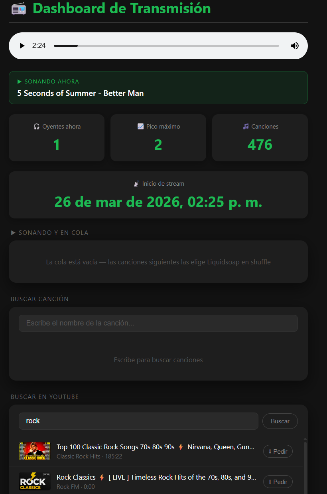
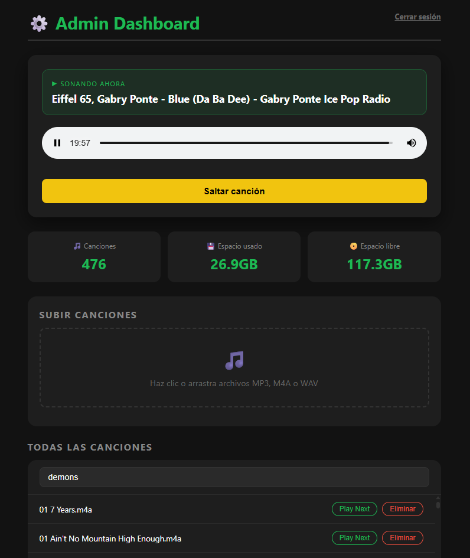

# 📻 Radio Dev (AutoDJ & Streaming Server)

Radio Dev es un sistema de transmisión de radio automatizado (AutoDJ) construido con **Python (Flask)**, **Liquidsoap** y **Icecast2**. Cuenta con un panel de control web, un dashboard para oyentes, soporte para búsqueda y descarga directa de música desde YouTube, e integración con Telegram para notificaciones y moderación de descargas.

---

## 🚀 Características Principales

- **AutoDJ y Transmisión Continua:** Reproduce música de forma aleatoria (fallback) o mediante una cola personalizada sin interrupciones gracias a Liquidsoap.
- **Dashboard Web en Tiempo Real:** Interfaz viva para los oyentes mostrando oyentes actuales, canción en reproducción, y buscador de canciones integrados.
- **Panel de Administración (Admin):** Permite subir nuevas canciones, eliminar archivos, y **saltar canciones** en directo.
- **YouTube Downloader Integrado (`yt-dlp`):** Busca canciones en YouTube desde la web y descárgalas directamente al servidor.
- **Integración con Bot de Telegram:** Recibe alertas y aprueba/rechaza peticiones de descarga desde la comodidad de tu chat.
- **Dockerizado:** Fácil de desplegar en cualquier nube gracias a Docker Compose.

---

## 🛠️ Tecnologías Usadas

- **Backend:** [Python 3.10](https://www.python.org/) con [Flask](https://flask.palletsprojects.com/) para la API y servidor web.
- **Motor de Audio:** [Liquidsoap 2.2.5](https://www.liquidsoap.info/) para la gestión de medios y [Icecast2](https://icecast.org/) para el streaming.
- **Frontend:** HTML5, CSS3 (Vanilla) y JavaScript (ES6+) con [Jinja2](https://jinja.palletsprojects.com/) para plantillas.
- **Seguridad:** [PyJWT](https://pyjwt.readthedocs.io/) para autenticación mediante tokens en el panel admin.
- **Descargas:** [yt-dlp](https://github.com/yt-dlp/yt-dlp) para la extracción de audio desde fuentes online.
- **Procesamiento de Audio:** [FFmpeg](https://ffmpeg.org/) para transcodificación y decodificación de metadatos.
- **Infraestructura:** [Docker](https://www.docker.com/) y [Docker Compose](https://docs.docker.com/compose/) para la orquestación de servicios.
- **Notificaciones:** [Telegram Bot API](https://core.telegram.org/bots/api) para la interacción remota y moderación.

---

## 📸 Capturas de Pantalla

### Dashboard de Oyentes    



### Panel de Administración



---

## 📂 Estructura del Proyecto

El proyecto está diseñado siguiendo una arquitectura modular en Python:

```text
radio/
├── core/                       # Lógica principal del AutoDJ
│   ├── routes/                 # Controladores y endpoints de la API Flask
│   │   ├── admin.py            # Rutas y seguridad del panel administrativo
│   │   └── api.py              # Endpoints del Dashboard, YouTube y Webhooks
│   ├── services/               # Integraciones con servicios externos
│   │   ├── liquidsoap.py       # Control por Telnet del motor Liquidsoap
│   │   ├── telegram.py         # Envío de notificaciones y botones al Bot
│   │   └── youtube.py          # Lógica de descarga y conversión usando yt-dlp
│   ├── config.py               # Carga centralizada de variables de entorno (.env)
│   ├── state.py                # Variables compartidas de memoria (colillas, bloqueos)
│   └── tasks.py                # Hilos en background (scan de playlist, gestión de cola)
├── musica/                     # Directorio (volumen) donde se almacenan y leen los .m4a y .mp3
├── static/                     # Archivos estáticos del frontend
│   ├── css/                    # Hojas de estilo (style.css, admin.css, login.css)
│   └── js/                     # Lógica cliente (dashboard.js, admin.js)
├── templates/                  # Plantillas HTML (Jinja2)
│   ├── index.html              # Dashboard principal para oyentes
│   ├── admin.html              # Panel de administración de música
│   └── login.html              # Pantalla de acceso seguro al admin
├── .env                        # [NO INCLUIDO] Variables de entorno (Configuración)
├── autodj.py                   # Script de arranque (Inicia Flask y tareas en segundo plano)
├── docker-compose.yaml         # Orquestación de contenedores (Python, Liquidsoap, Icecast)
├── Dockerfile                  # Receta de construcción del contenedor Python/AutoDJ
├── radio.liq                   # [Liquidsoap] Script de motor de radio y transcodificación
└── requirements.txt            # Dependencias de Python (Flask, requests, PyJWT, etc.)
```

---

## ⚙️ Cómo Funciona

1.  **El Motor de Radio (Icecast & Liquidsoap):**
    *   `Icecast` sirve el audio al oyente final (el stream que se escucha en el reproductor del dashboard).
    *   `Liquidsoap` (`radio.liq`) es el "DJ". Genera un flujo de audio constante leyendo la carpeta `/musica` en modo aleatorio (`fallback`) y gestiona una cola prioritaria (`radio_queue`) para canciones pedidas.
2.  **El Controlador (AutoDJ Python):**
    *   Ejecutado por `autodj.py`, expone una **API REST (Flask)**, lanza tareas en segundo plano para escanear nueva música, y se comunica con Liquidsoap a través de comandos **Telnet** (ej. para forzar el salto de una canción con `fallback.skip`).
3.  **El Frontend:**
    *   Vistas dinámicas servidas mediante Flask que consumen la misma API interna para mantener estadísticas actualizadas, pedir canciones y buscar en YouTube.

---

## 🛠️ Instalación y Despliegue

### Requisitos Previos
- Docker y Docker Compose instalados en tu servidor o máquina local.

### 1. Clonar el repositorio
```bash
git clone <tu-url-del-repositorio>
cd radio
```

### 2. Configurar las variables de entorno (`.env`)
En la raíz del proyecto, debes crear un archivo llamado `.env` basándote en la siguiente plantilla.

Crea el archivo `.env`:

```env
# ------------------------------
# 🎧 ICECAST & LIQUIDSOAP
# ------------------------------
ICECAST_HOST=icecast
ICECAST_PORT=8000
ICECAST_USER=tu_usuario_admin
ICECAST_PASS=tu_password_segura
ICECAST_MOUNT=/radio
STREAM_URL=https://tu-dominio.com/radio  # URL pública del reproductor (HTTPS recomendado)

# ------------------------------
# 🔐 ADMIN WEB
# ------------------------------
ADMIN_PASSWORD=password_super_secreta_tu_panel
SECRET_KEY=clave_aleatoria_jwt_larga_y_segura

# ------------------------------
# 🤖 TELEGRAM BOT
# ------------------------------
TELEGRAM_API=https://api.telegram.org/bot<TU_TOKEN_AQUI>
TELEGRAM_CHAT_ID=-100XXXXXXXXXX   # ID de tu canal, grupo o usuario de Telegram
```

### 3. Iniciar los servicios con Docker
Comienza a levantar todo el ecosistema (Icecast, Liquidsoap y Python) de forma orquestada:

```bash
docker-compose up -d --build
```

Al levantar, el sistema se encargará de:
1. Instalar `yt-dlp` y dependencias (ffmpeg) en el contenedor principal vía apt-get.
2. Levantar los servidores internos.
3. Liquidsoap se conectará a Icecast para enviar audio ininterrumpido a partir de los archivos en `./musica`.
4. El backend en Flask iniciará en el puerto designado recibiendo su tráfico en la web.

### 4. Acceder al sistema
- **Dashboard de Oyentes:** `http://tu-ip-o-dominio/`
- **Panel de Administración:** `http://tu-ip-o-dominio/admin` (te redirigirá a `/admin/login`)

---

## 📦 Desarrollo y Ampliación
Si deseas modificar los archivos del Dashboard (`index.html`) o del Panel de Admin (`admin.html`), puedes editar los archivos ubicados en las bibliotecas `templates/` o `static/` directamente. Al refrescar tu navegador, los cambios surtirán efecto de inmediato.

---

## 📄 Licencia

Este proyecto se distribuye bajo la licencia **GNU Affero General Public License v3 (AGPLv3)**. 

### ¿Qué significa esto?
- **Libertad de Uso y Mejora:** Puedes usar, estudiar y modificar este código libremente.
- **Copyleft Fuerte:** Si distribuyes una versión modificada (o permites que otros interactúen con ella a través de una red), estás obligado a liberar el código fuente bajo esta misma licencia.
- **Uso en Red:** A diferencia de la GPL estándar, la AGPLv3 requiere que si ejecutas este software en un servidor web, debes poner el código fuente a disposición de los usuarios que interactúan con él.

Para más detalles, consulta el archivo [LICENSE](LICENSE) incluido en el repositorio.
